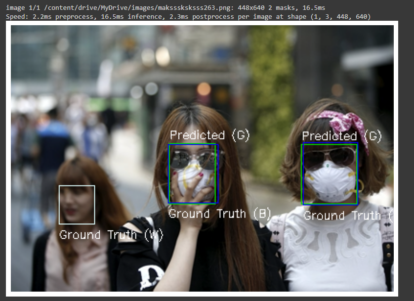

# Face-Mask-Detector-YOLO-Faster-R-CNN
CS-334 Final Project. All files/code found in the folder above. Images are found in "Images" and corresponding annotations in "Labels". The YOLO model's separate image/annotations are found in "YOLOv8". The project was developed in Google Collab using V100 GPU for runtime. Both Python notebook and Python file contain the same code.

.
